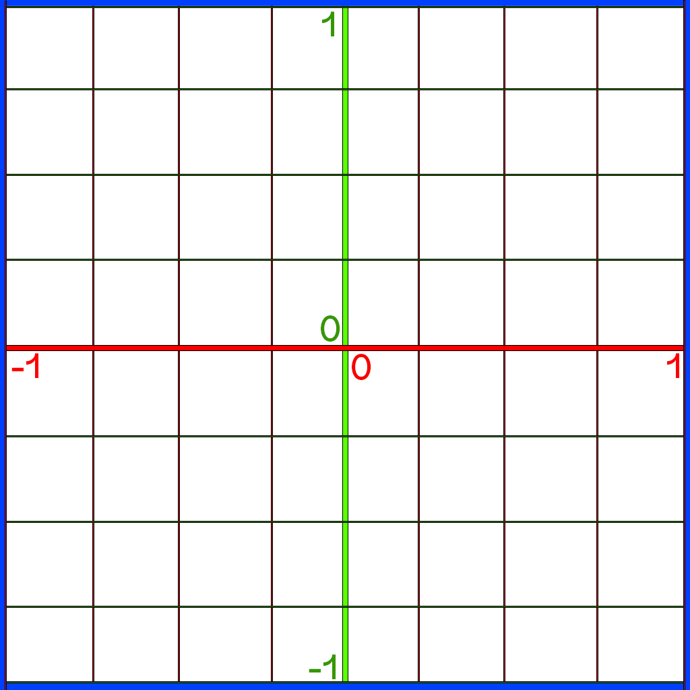

# XVolatile

<ul>
   <li><a href="#getting-started">Getting Started</a></li>  
   <li><a href="#initializing-glfw-window">Initializing The Window</a></li>   
   <li><a href="#rendering-pipeline">Rendering Pipeline Stages</a></li> 
   <li><a href="#coords">OpenGL Coordinate System</a></li> 
   <li><a href="#rendering-pipeline">Section 1</a>
      <ul>
         <li><a href="#subsection-1-1">Subsection 1.1</a></li>
      </ul>
   </li>
  <li><a href="#section-2">Section 2</a></li>
</ul>

## Getting Started {#getting-started}

`GLEW` : The OpenGL Extension Wrangler Library (GLEW) is a cross-platform open-source C/C++ extension loading library. GLEW provides efficient run-time mechanisms for determining which OpenGL extensions are supported on the target platform.
https://glew.sourceforge.net/

`GLFW` : an Open Source, multi-platform library for OpenGL, OpenGL ES and Vulkan development on the desktop. It provides a simple API for creating windows, contexts and surfaces, receiving input and events.
https://www.glfw.org/

To get started, a new c++ project was created in visual studio.
GLEW and GLFW were downloaded (pre-compiled binaries) and placed in the `ExternalLibs` directory.

These are the subsequent steps to take:

1. Open Solution Properties
2. Add the header files to include. In `C/C++ > General > Additional Include Directories` - added the following:
   - $(SolutionDir)/../ExternalLibs/glew-2.1.0/include
   - $(SolutionDir)/../ExternalLibs/glfw-3.3.8/include
3. Add the source files to include. In `Linker > General > Additional Library Directories` - added the following
   - $(SolutionDir)/../ExternalLibs/glew-2.1.0/lib/Release/x64
   - $(SolutionDir)/../ExternalLibs/glfw-3.3.8/lib-vc2022
4. Add the included libraries to the project dependencies, including the GLFW and GLEW library files, as well as the built in `opengl32` library. In `Linker > Input > Additional Dependencies` - added the following:
   - opengl32.lib;
   - glew32.lib;
   - glfw3.lib;
5. Copy the Dynamic Linking Library file `glew32.dll` from `ExternalLibs\glew-2.1.0\bin\Release\x64` to the root solution directory.

## Initializing the Window {#initializing-glfw-window}

The `XVolatile.cpp` file is the main entry point into the application, housing the `int main()` function, where the GLFW Window is created.
Initialization of the app and the window is a simple process, involving these following steps:

1. Setup GLFW window properties
   - Set OpenGL version to use (`GLFW_CONTEXT_VERSION_MAJOR` and `GLFW_CONTEXT_VERSION_MINOR`)
   - Disable older versions and prevent them from compiling `glfwWindowHint(GLFW_OPENGL_PROFILE, GLFW_OPENGL_CORE_PROFILE)`
   - Allow forward compatibility `glfwWindowHint(GLFW_OPENGL_FORWARD_COMPAT, GL_TRUE);`
2. Create GLFW window
   - Create a `GLFWwindow` pointer using `glfwCreateWindow()`
   - Set Buffer Size information using `glfwGetFramebufferSize()`
   - Set up Context for GLEW to use, using `glfwMakeContextCurrent(mainWindow)`
   - Can also enable support of experimental features, via `glewExperimental = GLFW_TRUE;`
3. Create GLEW Context. Initialize context by verifying that `glewInit() == GLEW_OK`
4. Setup viewport Size, using `glViewport()`
5. Enter the main loop
   - Get and handle user events using `glfwPollEvents()`. This allows for automatically refreshing the window when it's resized, and collecting other event data
   - Clear the previous frame buffer using `glClear()`. This function accepts an argument, to be told specifically which resource to clear
   - Replace the previously drawn scene/frame, with the new and currently updated scene/frame - using `glfwSwapBuffers(mainWindow);`

## Rendering Pipeline Stages {#rendering-pipeline}

Rendering is a multi-staged process in which a 3d scene (which is comprised of vector data, matrices, polygons and their coordinate data, shading, and more) has it's data sent to the GPU to be processed and rendered to the screen.
This process spans across 9 distinct stages, where 4 of these stages are reserved for Shading:

1. Vertex Specification
2. Vertex Shader (Programmable)
3. Tesselation Shader (Programmable)
4. Geometry Shader (Programmable)
5. Vertex Post-Processing
6. Primitive Assembly
7. Rasterization
8. Fragment(Pixel) Shader (Programmable)
9. Per-Sample Operations

Here is a more in-depth perspective at most of these stages:

##### 1. Vertex Specification:

- The process where vertex data is gathered
- Uses `VAO`, `VBO`, and `Attribute Pointers`
  - `Vertex Array Object` - Defines all the data values needed for each vertex (position, color, texture, normals, etc). Can hold one or multiple VBOs
  - `Vertex Buffer Object` - Defines the data itself
  - `Attribute Pointers` - Defines where and how shaders can access vertex data

##### 2. Vertex Shader:

- The process of applying position data FOR EACH vertex
- Setup of this shader stage is mandatory. Even if you don't need anything from the vertex shader, it still needs to assign vertex data to `gl_Position`, as this data is necessary for later stages
- Inputs to this shader consists of solely the Vertex Data itself
- Outputs from this shader can be used in later shading stages

##### 3. Tessellation Shader:

- Sub-divides topology to allow greater detail, mostly coupled with a height-map
- Can be used to dynamically add levels of detail based on distance from the camera
- A relatively new addition to the OpenGL rendering pipeline (version 4.0)

##### 4. Geometry Shader:

- Handles group of vertices together
- Can be used to create and manipulate primitive shapes

##### 5. Vertex Post-Processing:

- The process of committing to the vertex data and determining which vertices are redundant
- `Transform Feedback` - The result of the Vertex and Geometry stages that were saved to buffers for later use. Mandatory only if the vertex Position data is updated each frame
- `Clipping` - Conversion of units from `clip space` to `window space`. Additionally, any primitive that is not visible in the rendering space is being removed from rendering. as an optimization

##### 6. Primitive Assembly:

- Vertices are converted to a series of primitives
- `Face Culling` - removes any backward-facing polygon from rendering (anti-normals)

##### 7. Rasterization:

- Converts primitives into "Fragments" - `Fragments` are the pieces of data for each pixel - obtained from the rasterization process
- Fragment data is interpolated based on the relative position of each pixel

##### 8. Pixel Shader:

- The Fragment shader stage, is the process where each pixel is assigned an RGB value, according to the Fragment data
- Is optional but it’s rare to not use it. Exceptions are cases where only depth or stencil data is required
- Most important output is the color of the pixel that the fragment covers

##### 9. Per-Sample Operations:

- Series of tests run to see if the fragment should be drawn
- Most important test: Depth test. Determines if something is in front of the point being drawn
- `Color Blending` - can blend fragment color data with overlapping fragment color data (usually for transparency)
- Fragment data written to currently bound FrameBuffer (usually the default buffer)
- At this point usually a `Buffer Swap` is demanded - putting the newly drawn-to updated Frame-Buffer to the front, with that completing the rendering cycle

#### Summary

- Rendering Pipeline consists of several stages

- Four stages are programmable via shaders (Vertex, Tessellation, Geometry, Fragment)

- Vertex Shader is mandatory

- Vertices: User-defined points in space

- Primitives: Groups of vertices that make a simple shape (usually a triangle)

- Fragments: Per-pixel data created from primitives

- Vertex Array Object (VAO): WHAT data a vertex has

- Vertex Buffer Object (VBO): The vertex data itself

- Shader programs are created with at least a Vertex Shader and then activated before use

## OpenGL Coordinate System {#coords}

OpenGL uses `X` for Left to Right, `Y` for Up and Down, and `Z` for forwards and backwards like depth.

Before we draw something to the GL viewport, we need to consider OpenGL's default view orientation.
By default, the "camera view" of the OpenGL viewport is positioned on the `Z` axis, looking at the side section of the `X` and `Y` axes, as if it was a graph.
The default viewable range spans from (-1,-1) to (1,1), measured in cm.
Essentially, the initial viewport view consists of these 4 points:

- (-1,-1,0)
- (1,-1,0)
- (1,1,0)
- (-1,1,0)

The following image demonstrates the default view seen by the OpenGL viewport (although without the grid visually displayed).
Notice how we cannot see the `Z` axis in this 2D representation - as it initially serves as the axis of projection.
The `Z` axis is represented as the encompassing `blue` box in this image.



If we were to describe a triangle within these default set bounds, we could do so like this:

        -1.0f, -1.0f, 0.0f,            //Vertex No. 01

        1.0f, -1.0f, 0.0f,             //Vertex No. 02

        0.0f, 1.0f, 0.0f               //Vertex No. 03

When drawn to the viewport, the triangle would appear as such:


## Rendering In Practice

In this following example, we will complete a full render cycle, drawing a triangle to the screen.

This setup would consist of all mandatory Rendering Stages discussed earlier.

If you'd rather seeing the full code breakdown instead, go to the `Connecting The Pieces` article at the end of the document.

#### Part I) Vertex Specification Setup

###### 1. Define the shape to render

In this function, we define a `GLfloat` array that describes a triangle with 3 vertices, made up of 9 members in total.
For now, we make a mental segregation, where each 3 subsequent indices in the array compose a single Vector point (later we splice this array as such).

```cpp
void CreateTriangle()
{
   GLfloat Vertices[] = {
      -1.0f, -1.0f, 0.0f,
      1.0f, -1.0f, 0.0f,
      0.0f, 1.0f, 0.0f
   };
}
```

###### 2. Create a VAO

To render this description of a triangle, we would start by creating a VAO.
A VAO is an OpenGL object that encapsulates the configuration of vertex attribute pointers and their associated vertex buffers.

Creating a `Vertex Array Object` is done by calling the `glGenVertexArrays()` function.
This function allows us to dynamically reserve memory on the graphics card for one or even multiple arrays of Vertices.
Upon creation, the resulting Vertex Array would get a unique ID, which can be used to refer to that array later on.

This function expects 2 parameters:

- an integer, defines the number of arrays that should be created. Memory allocation is then transferred on to the GPU
- An address of a `GLuint` object, in which the ID of the array that was created by the function will be stored

Once created, the array will need to be bound in to the rendering cycle, using the `glBindVertexArray()` function.
function is used to bind a vertex array object (VAO) for subsequent use in rendering operations:

```cpp
GLuint VertexArrayObject;
...
void CreateTriangle()
{
   GLfloat Vertices[] = {
      -1.0f, -1.0f, 0.0f,
      1.0f, -1.0f, 0.0f,
      0.0f, 1.0f, 0.0f
   };

   glGenVertexArrays(1, &VertexArrayObject);
   glBindVertexArray(VertexArrayObject);
}
```

When `glBindVertexArray()` is called with a VAO identifier as the argument, it sets that VAO as the currently active VAO in the OpenGL context. Subsequent OpenGL calls that depend on vertex data will use the state stored in the bound VAO.

To understand the purpose of `glBindVertexArray()`, it's important to understand how vertex data is organized and accessed in OpenGL. Vertex data typically consists of attributes such as position, color, normal, and texture coordinates. These attributes are stored in one or more vertex buffers.

The VAO acts as a container for the configuration of vertex attributes and their associated vertex buffers. It specifies how the attributes are organized and how they are accessed by the vertex shader during rendering. By binding a VAO using `glBindVertexArray()`, you indicate that subsequent rendering operations should use the vertex attribute configuration stored in that VAO.

###### 3. Create a VBO

In OpenGL, a VBO stands for Vertex Buffer Object. It is a buffer object that holds vertex data, such as positions, normals, colors, and texture coordinates, used in rendering 3D geometry.

A VBO provides a way to efficiently store and manage vertex data on the GPU (Graphics Processing Unit). Instead of sending vertex data to the GPU on a per-vertex basis, which can be slow and inefficient, you can upload the vertex data to a VBO once and then use it for multiple rendering operations.

---

Creating our VBO starts somewhat similar to how we created the VAO - we generate an object, and bind it to the current context.
However, we then have to specify how much memory should the buffer reserve for this array, using the `glBufferData()`.

This function expects 4 parameters:

- The context to bind to (`GL_ARRAY_BUFFER`)
- The size that should be reserved in memory for the array (`sizeof(GLfloat) * 9` or `sizeof(Vertices)`)
- The actual array that holds the vertex data (`Vertices`)
- The method by which vertices will be drawn (`GL_STATIC_DRAW`)
  - A static draw means that the vertices location cannot change during runtime. If vertices were to move, like World Position Offset, then `GL_DYNAMIC_DRAW` would have been needed to be used instead, with a slightly different setup

```cpp
glBufferData(GL_ARRAY_BUFFER, sizeof(GLfloat) * 9, Vertices, GL_STATIC_DRAW);
```

---

Once memory for the vertex data has been allocated, we will need to specify the layout and structure of it, using `glVertexAttribPointer()`.
This function is defining how the data of the array should be read and processed.
Using this function, we can explicitly specify for OpenGL to treat each chunk of 3 members as a single structure.
Alternatively, we could have structured and formatted the array to include more types of data, such as color, and then tell this function to skip every 3 members within the array. Similarly, if we wanted to include color AND some other data layer in addition to the position, we could tell this function to skip 6 members.

Here is what such array might look like:

```cpp
      -1.0f, -1.0f, 0.0f,        //POSITION - Vert #01
      1.0f, 0.0f, 0.0f,          //  Color
      1.0f, 0.0f, 0.0f,          //    SomeOtherData
      1.0f, -1.0f, 0.0f,         //POSITION - Vert #02
      0.0f, 1.0f, 0.0f,          //  Color
      1.0f, 0.0f, 0.0f,          //    SomeOtherData
      0.0f, 1.0f, 0.0f           //POSITION - Vert #03
      0.0f, 0.0f, 1.0f,          //  Color
      1.0f, 0.0f, 0.0f,          //    SomeOtherData
```

The `glVertexAttribPointer()` function takes in many different parameters, and it is important to understand what each and every one of them means, and what is it used for:

- `Index`: The address location. This is the index of the vertex attribute in the vertex shader. It corresponds to the layout location specified in the vertex shader code using the layout(location = index) syntax. If this was a multiple Shaders setup, this value would increment | (`0`)
- `Size`: Specifies the number of components per vertex attribute. The number of adjacent members in the index to consider a singular structure | (`3`)
- `Type`: This parameter indicates the data type of each component in the attribute | (`GL_FLOAT`)
- `Normalized`: Toggle whether the vertex attribute values should be normalized or not | (`GL_FALSE`)
  - If set to `GL_TRUE`, the attribute values will be normalized to a range of [-1, 1] or [0, 1], depending on the attribute type
- `Stride`: Specifies the byte offset between consecutive attributes. `0` means no stride, and the array is read as is, according to the `Size` groupings | (`0`)
- `Offset`: The amount of offset to apply before reading the array. Can exclude certain vertices this way. `0` means no offset | (`42`)

```cpp
glVertexAttribPointer(0, 3, GL_FLOAT, GL_FALSE, 0, 0);
```

---

Lastly, we will need to call to the `glEnableVertexAttribArray()` function, to actually enable the attributes we are using.
This function takes a single input parameter, which is the location address that was previously fed to the address at `glVertexAttribPointer()`.

These 2 values (`0` in this case) correspond to each other - and this value is also needed by the VertexShader, as we will later see:

```cpp
glVertexAttribPointer(0, ...);
...
glEnableVertexAttribArray(0);
```

---

Creating the VBO can be summarized in these following steps:

1. Generate a VBO identifier using the `glGenBuffers()` function.
2. Bind the VBO using the `glBindBuffer()` function to make it the active VBO.
3. Upload the vertex data to the VBO using the `glBufferData()` or `glBufferSubData()` function.
4. Configure vertex attribute pointers using the `glVertexAttribPointer()` function, specifying the layout and structure of the vertex data.
5. Enable the vertex attributes using the `glEnableVertexAttribArray()` function.
6. Can finally Draw the geometry using drawing commands such as `glDrawArrays()` or `glDrawElements()`.

```cpp
GLuint VertexArrayObject, VertexBufferObject;
...
void CreateTriangle()
{
   GLfloat Vertices[] = {
      -1.0f, -1.0f, 0.0f,
      1.0f, -1.0f, 0.0f,
      0.0f, 1.0f, 0.0f
   };

   glGenVertexArrays(1, &VertexArrayObject);
   glBindVertexArray(VertexArrayObject);

   glGenBuffers(1, &VertexBufferObject);
   glBindBuffer(GL_ARRAY_BUFFER, VertexBufferObject);
   glBufferData(GL_ARRAY_BUFFER, sizeof(GLfloat) * 9, Vertices, GL_STATIC_DRAW);
   glVertexAttribPointer(0, 3, GL_FLOAT, GL_FALSE, 0, 0);
   glEnableVertexAttribArray(0);
}
```

###### 4. UnBind the VBO and VAO

Once all vertex specification data was passed to the GPU, we will need to unbind the `Buffer` and the `VertexArray`.

This happens very much like a babushka setup:

```html
<VertexArrayObject>
  <VertexBufferObject>
    <!-- upload, specify and enable vertex data & attributes -->
  </VertexBufferObject>
</VertexArrayObject>
```

By calling the `Bind` functions and passing `0` to them, we effectively unbind the vertex data from the memory allocation:

```cpp
GLuint VertexArrayObject, VertexBufferObject;
...
void CreateTriangle()
{
   GLfloat Vertices[] = {
      -1.0f, -1.0f, 0.0f,
      1.0f, -1.0f, 0.0f,
      0.0f, 1.0f, 0.0f
   };

   // Create VAO and Bind
   glGenVertexArrays(1, &VertexArrayObject);
   glBindVertexArray(VertexArrayObject);

   // Create VBO and Bind
   glGenBuffers(1, &VertexBufferObject);
   glBindBuffer(GL_ARRAY_BUFFER, VertexBufferObject);

   // Allocate storage space on GPU, upload the vertex data according to some specification, and enable the vertex data array
   glBufferData(GL_ARRAY_BUFFER, sizeof(Vertices), Vertices, GL_STATIC_DRAW);
   glVertexAttribPointer(0, 3, GL_FLOAT, GL_FALSE, 0, 0);
   glEnableVertexAttribArray(0);

   // Unbind VBO and VAO
   glBindBuffer(GL_ARRAY_BUFFER, 0);
   glBindVertexArray(0);
}
```

#### Part II) Shading & Rendering Process

Shaders are executable programs or code files, which can use and manipulate data on the GPU.
These programs are very similar to C/C++ syntax - having a `main` function in which most calculations take place.
This is the main entry point into the shader program.

Shaders are commonly stored as `const char*` variables.
Shader code has many syntactic and operational nuances, which may vary based on the Shader Type.
The common thing about all shader types, is that they initially must declare which version of `GLSL` should be used, using the `#version ...` preprocessor directive.
This version of `GLSL` should match the `MAJOR+MINOR` `OpenGL` version as defined in the application code.

In this section, we will cover each step necessary in order to link and execute and render a Shader Program.

---

###### Vertex Shader Basics

The Vertex Shader has 3 main important requirements to consider:

1. The `#version` set, indicating which version of GLSL should be used
2. The `layout` declaration - this `location` corresponds to the address of the shader as given in `glVertexAttribPointer(0, ...);` and `glEnableVertexAttribArray(0);`
3. The `main()` function - The minimum mandatory contents for the main function in the Vertex Shader must consist of the `gl_Position` variable being set with a `vec4`
   - This position variable is being set with the position data coming from the layout input `vec3` variable, `pos` (can be named anything)

```cpp
static const char* VertexShader = "            \n\
#version 330                                   \n\
                                               \n\
layout (location = 0) in vec3 pos;             \n\
                                               \n\
void main()                                    \n\
{                                              \n\
  gl_Position = vec4(pos.x, pos.y, pos.z, 1.0);\n\
}";

```

Using the vertex shader, we can define and manipulate the position of the vertices.

###### Fragment Shader Basics

The Pixel Shader has 3 main important requirements to consider:

1. The `#version` set, indicating which version of GLSL should be used
2. The `out` variable declaration - this output must be a `vec4`, which would always represent the color (variable can be named anything)
3. The `main()` function - this is where the color of the vertices can be defined

```cpp
static const char* PixelShader = "     \n\
#version 330                           \n\
                                       \n\
out vec4 color;                        \n\
                                       \n\
void main()                            \n\
{                                      \n\
   color = vec4(1.0, 0.0, 0.0, 1.0);   \n\
}";

```

Using the pixel shader, we can define and manipulate the colors and graphical properties of each vertex.

###### Error Handling Concerns

Debugging errors coming from the GPU can be very tricky - and for this reason we should provide error checking
early on, to prevent evasive bugs and errors.

The `glGetShaderiv()` and `glGetProgramiv()` functions are used to retrieve information about shader objects and shader programs, respectively, in OpenGL.

The `glGetShaderiv()` function retrieves information about a specific shader object. It takes the following parameters:

- `shader`: The handle to the shader object you want to query.
- `pname`: The parameter name, indicating the type of information you want to retrieve.
- `params`: A pointer to a variable or array where the retrieved information will be stored.

The glGetProgramiv() function retrieves information about a specific shader program. It takes the following parameters:

- `program`: The handle to the shader program you want to query.
- `pname`: The parameter name, indicating the type of information you want to retrieve.
- `params`: A pointer to a variable or array where the retrieved information will be stored.

Both functions work in a similar way. They retrieve various types of information based on the `pname` parameter, such as compilation status, linking status, validation status, log length, etc. The retrieved information is then stored in the params variable or array.

To use these functions, you need to pass the appropriate `pname` value to specify the type of information you want to retrieve. For example, to check the compilation status of a shader object, you would set `pname` to `GL_COMPILE_STATUS`. The params variable should be of the appropriate type to receive the retrieved information.

For these checks, we will need to create a `GLint` variable, to store the result status of the `Get` attempt.

```cpp
GLint result = 0;
...
glGetShaderiv(Shader, GL_COMPILE_STATUS, &result);
if (result){
   // shader compiled successfully
}
else{
   // error: compilation failed
}
```

At this point, if `result` is null, then we know that the data we were trying to access is not valid.
If the data is indeed invalid, then we might want to call `glGetShaderInfoLog()` or `glGetProgramInfoLog()` to retrieve logs in such cases.
For this, we will need to create a `GLchar` variable, pass it to the info getter, and store the logs in it so it could be printed.

```cpp
GLint result = 0;
GLchar Logs[1024] = { 0 };
...
glGetShaderiv(Shader, GL_COMPILE_STATUS, &result);
    if (!result)
    {
      glGetShaderInfoLog(Shader, sizeof(Logs), NULL, Logs);
      printf("Shader Compilation FAILED! \n Log Info: \n %s", Logs);
    }
```

Having to log for errors everywhere can get messy and bloated, so instead of having to write an error handling operation for each Shader and Shader program in each part of the compilation process - we can simply create a generic error handling function, that handles errors for Shaders and Shader Programs.

```cpp
bool VerifyIsValid(GLuint ShaderOrProgram, GLenum StatusType)
{
    const bool Compiling = StatusType == GL_COMPILE_STATUS;
    static GLchar Log[1024] = { 0 };
    GLint Result = 0;

    Compiling ?
        glGetShaderiv(ShaderOrProgram, StatusType, &Result)
        :
        glGetProgramiv(ShaderOrProgram, StatusType, &Result)
        ;
    if (!Result)
    {
        Compiling ?
            glGetShaderInfoLog(ShaderOrProgram, sizeof(Log), NULL, Log)
            :
            glGetProgramInfoLog(ShaderOrProgram, sizeof(Log), NULL, Log)
            ;
        printf("Shader creation of %d type FAILED! \n Log Info: \n %s", StatusType, Log);
        return false;
    }
    else {
        return true;
    }
}
```

This function can then be used later for all the checks we will need, and even for getting a success bool so we'll know if to continue or break execution based on it's returned result.

###### Executing Shader Programs

A shader program goes through several steps from it's creation until it's use in rendering.
Also, this process would involve several functions, and may span across multiple code files.

First, we will need to define a function that can handle the creation of a shader.

- This function would initialize a `GLuint` variable via the `glCreateShader()` function, provided with a `GLenum` that specifies the shader type to be created
- The shader code should be passed to a `const GLchar*` null-terminated array. This prevents having to copy the string, and saves up on memory
- Extract the length of the shader code string (optional if using a null-terminated char array)

```cpp
void CreateShader(GLuint ShaderProgram, const char* ShaderCode, GLenum ShaderType)
{
   GLuint Shader = glCreateShader(ShaderType);

   const GLchar* Code[1];
   Code[0] = ShaderCode;

   GLint CodeLength[1];
   CodeLength[0] = strlen(ShaderCode);
}
```

With all the necessary data about the shader successfully gathered, we still have 3 more functions to call:

- `glShaderSource()` - Provides the shader source code to the graphics unit
- `glCompileShader()` - Compile the shader using the graphics processing unit
- `glAttachShader()` - Attach the compiled Shader to the associated Shader Program

```cpp
void CreateShader(GLuint ShaderProgram, const char* ShaderCode, GLenum ShaderType)
{
   ...
   glShaderSource(Shader, 1, Code, CodeLength);
   glCompileShader(Shader);
   glAttachShader(ShaderProgram, Shader);
}
```

The `glShaderSource()` function allows you to provide the shader's source code as a string or an array of strings. Each string represents a line or a portion of the shader code. If you pass an array of strings, they will be concatenated to form the complete shader source.

Typically, you would create a character array or string literal to hold the shader source code, as shown in the above example. The source code is then passed to `glShaderSource()` to set it for the specified shader object.

Once you have set the shader source code using `glShaderSource()`, you still need to compile the shader using `glCompileShader()` to create a compiled shader object. After that, you can finally verify all is well using the error handling function, and attach the shader to a shader program using `glAttachShader()` (and link the program using `glLinkProgram()`, eventually).

```cpp
void CreateShader(GLuint ShaderProgram, const char* ShaderCode, GLenum ShaderType)
{
   GLuint Shader = glCreateShader(ShaderType);

   const GLchar* Code[1];
   Code[0] = ShaderCode;

   GLint CodeLength[1];
   CodeLength[0] = strlen(ShaderCode);

   glShaderSource(Shader, 1, Code, CodeLength);
   glCompileShader(Shader);

   const bool Success = VerifyIsValid(Shader, GL_COMPILE_STATUS);
   if (Success) glAttachShader(ShaderProgram, Shader);
}
```

###### Compiling Shaders

Compiling the shaders mostly consists of the creation of a `Shader Program`, compiling the various shading stages it should involve, and linking that program with the graphics processor.
This can be broken down to 3 steps:

1. use `glCreateProgram()` to initialize a local/global `GLuint` instance and store it's ID
2. Use the previously defined `CreateShader()` function to compile each shader type this object should have
3. Link the Shader Program to the GPU using the `glLinkProgram()` function

```cpp
void CompileShaders()
{
   GLuint ShaderProgram = glCreateProgram();

   if (!ShaderProgram) {
      printf("Shader program creation FAILED!");
      return;
   }

   CreateShader(ShaderProgram, VertexShader, GL_VERTEX_SHADER);
   CreateShader(ShaderProgram, PixelShader, GL_FRAGMENT_SHADER);

   glLinkProgram(ShaderProgram);
}
```

Last thing we may want to do, is to provide error handling for our Shader Program.
For this, we can use the error handling function we previously created, and perform a check on the `GL_LINK_STATUS`.

Additionally, we can validate the program using `glValidateProgram()`, and perform a check on the `GL_VALIDATE_STATUS`.

```cpp
void CompileShaders()
{
   ShaderProgram = glCreateProgram();

   if (!ShaderProgram) {
      printf("Shader program creation FAILED!");
      return;
   }

   CreateShader(ShaderProgram, VertexShader, GL_VERTEX_SHADER);
   CreateShader(ShaderProgram, PixelShader, GL_FRAGMENT_SHADER);

   glLinkProgram(ShaderProgram);
   VerifyIsValid(ShaderProgram, GL_LINK_STATUS);

   glValidateProgram(ShaderProgram);
   VerifyIsValid(ShaderProgram, GL_VALIDATE_STATUS);
}

```

###### GPU Rendering

Once all of our shader programs and compilation setup is complete, we can call our `CreateTriangle()` and `CompileShaders()` functions in the main function, just before the main loop starts.
This will effectively create and register all the vertex data the topology needs, then create the shader program and compile the shaders, initializing our scene rendering.

```cpp
int main()
{
   ...

   //Initialize scene rendering
   CreateTriangle();
   CompileShaders();

   //Main loop
   while (!glfwWindowShouldClose(MainWindow))
   {...}
}

```

With the scene initialized, the last thing left to do is to run the Shader Program(s) it contains.
This is achieved by calling some "drawing" function, such as `glDrawArrays()`, after the shader program starts.
However before that, we still need to run the program, by calling `glUseProgram()` on our Shader Program.

After that, the 3d mesh / vertex array data which should be applying these shaders needs to be bound, using `glBindVertexArray()`.
Only then we can draw the render.

Finally, anything that was run and bound needs to be unsubscribed. This simply involves passing `0` to `glBindVertexArray()` and `glDrawArrays()`.

```cpp
int main()
{
   ...

   //Initialize scene rendering
   CreateTriangle();
   CompileShaders();

   //Main loop
   while (!glfwWindowShouldClose(MainWindow))
   {
      ...

      glUseProgram(ShaderProgram);
         glBindVertexArray(VertexArrayObject);
            glDrawArrays(GL_TRIANGLES, 0, 3);
         glBindVertexArray(0);
      glUseProgram(0);

      // RENDER CYCLE END
      glfwSwapBuffers(MainWindow);
   }
}

```

And with that, our render cycle is completed! We have successfully rendered a colored triangle to the screen!

## Connecting The Pieces

This is a technical breakdown of all the components necessary for the minimal setup of a rendering pipeline using OpenGL.
All code exists within one file, and this breakdown would document each part of it, from top to bottom.

At the end of this breakdown, you can find the full script in it's entirety for further reference.

#### Breakdown

###### 1. Global Variables & Shaders Definition

This initial part involves linking all of the headers the we need to `include`.

Then, we create 2 `GLint` variables to store the initial window size.

We then immediately create 3 `GLuint` objects, that will be used later for the `Vertex Specification` abd `Shading` stages.

Lastly, we define 2 simple shaders (vertex + pixel) within a `const char*` variable type.

```cpp
#include <stdio.h>
#include <string.h>
#include <GL/glew.h>
#include <GLFW/glfw3.h>

// Window size
const GLint WIDTH = 800;
const GLint HEIGHT = 600;

// Each object we draw will need to have it's own VAO, VBO and ShaderProgram
GLuint VertexArrayObject, VertexBufferObject, ShaderProgram;

// Vertex Shader Code
static const char* VertexShader = "                \n\
#version 330                                       \n\
                                                   \n\
layout (location = 0) in vec3 pos;                 \n\
                                                   \n\
void main()                                        \n\
{                                                  \n\
   gl_Position = vec4(pos.x, pos.y, pos.z, 1.0);   \n\
}";

// Fragment Shader Code
static const char* PixelShader = "     \n\
#version 330                           \n\
                                       \n\
out vec4 color;                        \n\
                                       \n\
void main()                            \n\
{                                      \n\
    color = vec4(1.0, 0.0, 0.0, 1.0);  \n\
}";
```

###### 2. Define a Generic Error Handler

This error handler function is defined for later use, whenever a shader program needs linking and validation, or when a shader needs to compile.
if `Compiling == true` then we know we are dealing with a shader - but if it is false, we know we are dealing with a program.

```cpp
// Provide basic generic testing for Shaders / Shader Programs
bool VerifyIsValid(GLuint ShaderProgram, GLenum StatusType)
{
    // Determine test type
    const bool Compiling = StatusType == GL_COMPILE_STATUS;

    // Define internal data storage for status and logs
    static GLchar Log[1024] = { 0 };
    GLint Result = 0;

    // Get validity status from Program/Shader
    Compiling ?
        glGetShaderiv(ShaderProgram, StatusType, &Result)
        :
        glGetProgramiv(ShaderProgram, StatusType, &Result)
        ;
    if (!Result)
    {
        // Get error info logs
        Compiling ?
            glGetShaderInfoLog(ShaderProgram, sizeof(Log), NULL, Log)
            :
            glGetProgramInfoLog(ShaderProgram, sizeof(Log), NULL, Log)
            ;
        printf("Shader creation of %d type FAILED! \n Log Info: \n %s", StatusType, Log);

        // Test Failure
        return false;
    }
    else {
        // Test Success
        return true;
    }
}
```

###### 3. Define Function For Shader Instantiation

This function is responsible for taking a shader program and initializing a living shader instance of the desired type (fragment, vertex, etc...).

We then create a new pointer to a `GLchar` and point it's first character to read the code `const char*` string directly from memory.
Additionally, the length of the "code file" is stored for memory allocation later.

From there on we proceed with assigning the shader data to the newly created shader instance, compile it, verify it is valid, and finally attach it to the working context.

```cpp
// Instantiate a single Shader Pass
void CreateShader(GLuint ShaderProgram, const char* ShaderCode, GLenum ShaderType)
{
   // Instantiate a new Shader
   GLuint Shader = glCreateShader(ShaderType);

   // Get reference to the code of the Shader, and store it's length
   const GLchar* Code[1];
   Code[0] = ShaderCode;

   GLint CodeLength[1];
   CodeLength[0] = strlen(ShaderCode);

   /*
   Assign the code to the newly Instantiated shader,
   and allocate memory in storage according to the code's length
   */
   glShaderSource(Shader, 1, Code, CodeLength);

   // Compile the shader
   glCompileShader(Shader);

   // Verify the shader has compiled
   VerifyIsValid(Shader, GL_COMPILE_STATUS);

   //If compiled successfully, the shader still has to be attached to the OpenGL context
   glAttachShader(ShaderProgram, Shader);
}
```

###### 4. Define Function For Compiling the Shaders

This function takes the globally declared variable reserved for the ID of the `ShaderProgram`, and initializes a new shader program.
Upon initialization, this variable would store the ID generated for the shader program, returned from the `glCreateProgram()` function.

Once initialized, the program is then passed to our previously created function, `CreateShader()`, for instantiating the Vertex and Pixel shaders.

Finally, the program is linked, and validated.

- NOTE:
  - In a real app scenario (where multiple objects/assets and shader programs are involved), This function would be called `CompileShader()`, storing generic instructions for creating shaders and programs - while another function would be called `CompileShaders()` where all of the shader programs that needs to be compiled will be specified, allowing chunk compilation of all your shaders in a single call.

```cpp
// Create a new shader program and compile it's individual components
void CompileShaders()
{
   // Initialize a new Shader Program
   ShaderProgram = glCreateProgram();

   if (!ShaderProgram) {
      printf("Shader program creation FAILED!");
      return;
   }

   // Instantiate the Vertex & Pixel Shaders
   CreateShader(ShaderProgram, VertexShader, GL_VERTEX_SHADER);
   CreateShader(ShaderProgram, PixelShader, GL_FRAGMENT_SHADER);

   // Link the program with the GPU, and verify LINK is valid
   glLinkProgram(ShaderProgram);
   VerifyIsValid(ShaderProgram, GL_LINK_STATUS);

   // Validate the program, and verify VALIDATE is valid
   glValidateProgram(ShaderProgram);
   VerifyIsValid(ShaderProgram, GL_VALIDATE_STATUS);
}
```

###### 5. Define Function For Generating Topology

In this example function, we create a simple triangle, composed of 3 vertices.

- The triangle is composed within a 1D array, where each 3 subsequent members in the array describe the location of a single vertex.

- After that, we generate a new ID for the VAO , and bind it to memory. We then proceed with doing the same for the VBO, generating a buffer and binding it to memory as well.

- At this point, we have access to the buffer, so we pass data to that buffer and instruct it to use `GL_STATIC_DRAW`. While still there, we also define the link of the vertex data with the vertex shader layout position, and enable that link.

- Finally, we clean-up by unbinding the buffer and the vertex array.

```cpp
// Define and Create Triangle topology
void CreateTriangle()
{
   // Define vertices positioning
   GLfloat Vertices[] = {
      -1.0f, -1.0f, 0.0f,    //Vertex #1
      1.0f, -1.0f, 0.0f,     //Vertex #2
      0.0f, 1.0f, 0.0f       //Vertex #3
   };

   // Generate a vertex array, store it in the VAO, and bind it
   glGenVertexArrays(1, &VertexArrayObject);
   glBindVertexArray(VertexArrayObject);

      // Generate buffer, store it in the VBO, and bind it
      glGenBuffers(1, &VertexBufferObject);
      glBindBuffer(GL_ARRAY_BUFFER, VertexBufferObject);

         // Allocate storage for the buffer to upload the vertex array position data
         glBufferData(GL_ARRAY_BUFFER, sizeof(GLfloat) * 9, Vertices, GL_STATIC_DRAW);
         // Define the layout and settings of the vertex data
         glVertexAttribPointer(0, 3, GL_FLOAT, GL_FALSE, 0, 0);
         // Enable attributes and link the vertex data with a `Layout Location`
         glEnableVertexAttribArray(0);

      // Unbind the buffer
      glBindBuffer(GL_ARRAY_BUFFER, 0);
   // Unbind the vertex data
   glBindVertexArray(0);
}
```

###### 6. Connecting Everything in the Main() Function

In the main function, we would have all the `GLEW` and `GLFW` setup and initialization, to create the OpenGL context and Window.

We then set up the scene rendering by creating the generating the topology and compiling the shaders.

Lastly, we enter the main loop, where we finally execute the `ShaderProgram`, bind to it's vertex data, and draw it all to the screen.

```cpp
int main()
{
   // Initialise GLFW and verify it
   if (!glfwInit())
   {
      printf("Initialisation Error!");
      glfwTerminate();
      return 1;
   }

   // Setup GLFW window properties
   //OpenGL Version 3.3
   glfwWindowHint(GLFW_CONTEXT_VERSION_MAJOR, 3);
   glfwWindowHint(GLFW_CONTEXT_VERSION_MINOR, 3);
   //Force depcrated code below this version to NOT compile - CORE_PROFILE == No Backwards Compatability
   glfwWindowHint(GLFW_OPENGL_PROFILE, GLFW_OPENGL_CORE_PROFILE);
   //Allow backwards campatibility
   glfwWindowHint(GLFW_OPENGL_FORWARD_COMPAT, GL_TRUE);

   // Create GLFW window
   GLFWwindow* MainWindow = glfwCreateWindow(WIDTH, HEIGHT, "XVolatile", NULL, NULL);
   if (!MainWindow)
   {
      printf("Window Initialisation Error!");
      glfwTerminate();
      return 1;
   }

   // Set Buffer Size information
   int BufferWidth, BufferHeight;
   glfwGetFramebufferSize(MainWindow, &BufferWidth, &BufferHeight);
   // Set up Context for GLEW to use
   glfwMakeContextCurrent(MainWindow);
   // Enable Experimental features
   glewExperimental = GLFW_TRUE;

   // Create GLEW Context
   if (glewInit() != GLEW_OK)
   {
      printf("Glew Initialisation Error!");
      glfwDestroyWindow(MainWindow);
      glfwTerminate();
      return 1;
   }

   // Setup viewport Size
   glViewport(0, 0, BufferWidth, BufferHeight);

   // Initialize Scene rendering
   CreateTriangle();
   CompileShaders();

   // Main Loop - Looping as long as the window is open
   while (!glfwWindowShouldClose(MainWindow))
   {
      // Get & Handle user events
      glfwPollEvents();

      // Clear the screen color buffer and set overlay color
      glClearColor(0.0f, 0.0f, 1.0f, 1.0f);
      glClear(GL_COLOR_BUFFER_BIT);

      // Run the Shader program
      glUseProgram(ShaderProgram);

         glBindVertexArray(VertexArrayObject);

               glDrawArrays(GL_TRIANGLES, 0, 3);

         glBindVertexArray(0);

      glUseProgram(0);

      //Replace the previous frame's scene and render the updated scene | RENDER CYCLE END
      glfwSwapBuffers(MainWindow);
   }

   return 0;
}
```

This concludes this code breakdown!

#### Full Code Example

This is the full code example of the entire setup and rendering operations.

Do note, that this code will only compile after `GLEW` and `GLFW` are set-up, as demonstrated in the `Getting Started` article at the top of the document.

The provided code is a C++ program that demonstrates the basic setup and usage of shaders in OpenGL. It creates a window using GLFW, sets up an OpenGL context, and renders a simple triangle using shaders.

Here's a breakdown of the code:

1. The necessary header files are included: `<stdio.h>` for printing messages, `<string.h>` for string manipulation, `<GL/glew.h>` for OpenGL extension loading, and `<GLFW/glfw3.h>` for window management.

2. The window size is defined using the constants WIDTH and HEIGHT.

3. Global variables are declared for the Vertex Array Object (VAO), Vertex Buffer Object (VBO), and Shader Program.

4. Vertex and Fragment shader code are defined as character arrays (VertexShader and PixelShader).

5. The `VerifyIsValid()` function is defined to check the validity of shaders and shader programs.

6. The `CreateShader()` function is defined to compile and attach shaders to the shader program.

7. The `CompileShaders()` function is defined to create a shader program and compile its individual components (vertex and fragment shaders).

8. The `CreateTriangle()` function is defined to set up the vertices of a triangle and create the VAO and VBO for rendering it.

9. The `main()` function is where the program execution starts. It initializes GLFW, creates a window, sets up OpenGL context, and initializes GLEW.

10. The viewport size is set to match the window's framebuffer size.

11. The `CreateTriangle()` and `CompileShaders()` functions are called to set up the triangle geometry and compile the shaders.

12. The main loop begins (`while (!glfwWindowShouldClose(MainWindow))`), where user events are polled, the screen is cleared, and the triangle is drawn using the shader program.

13. Finally, the updated scene is rendered (`glfwSwapBuffers(MainWindow)`) and the program continues until the user closes the window.

In summary, this code sets up a window, creates a triangle using vertex and fragment shaders, and continuously renders the triangle until the window is closed. It provides a basic framework for understanding shader compilation, shader programs, and rendering with OpenGL.

```cpp
// XVolatile.cpp : This file contains the 'main' function. Program execution begins and ends here.

// 1) - - - - - - - - - - - - - - - - - - - - - - - - - - - - - - - - - - - - - - - - - - - - - - - - - - - - - - - - -

#include <stdio.h>
#include <string.h>
#include <GL/glew.h>
#include <GLFW/glfw3.h>

// Window size
const GLint WIDTH = 800;
const GLint HEIGHT = 600;

// Each object we draw will need to have it's own VAO, VBO and ShaderProgram
GLuint VertexArrayObject, VertexBufferObject, ShaderProgram;

// Vertex Shader Code
static const char* VertexShader = "              \n\
#version 330                                     \n\
                                                 \n\
layout (location = 0) in vec3 pos;               \n\
                                                 \n\
void main()                                      \n\
{                                                \n\
   gl_Position = vec4(pos.x, pos.y, pos.z, 1.0); \n\
}";

// Fragment Shader Code
static const char* PixelShader = "     \n\
#version 330                           \n\
                                       \n\
out vec4 color;                        \n\
                                       \n\
void main()                            \n\
{                                      \n\
   color = vec4(1.0, 0.0, 0.0, 1.0);   \n\
}";

// 2) - - - - - - - - - - - - - - - - - - - - - - - - - - - - - - - - - - - - - - - - - - - - - - - - - - - - - - - - -

// Provide basic generic testing for Shaders / Shader Programs
bool VerifyIsValid(GLuint ShaderProgram, GLenum StatusType)
{
   // Determine test type
   const bool Compiling = StatusType == GL_COMPILE_STATUS;

   // Define internal data storage for status and logs
   static GLchar Log[1024] = { 0 };
   GLint Result = 0;

   // Get validity status from Program/Shader
   Compiling ?
      glGetShaderiv(ShaderProgram, StatusType, &Result)
      :
      glGetProgramiv(ShaderProgram, StatusType, &Result)
      ;
   if (!Result)
   {
      // Get error info logs
      Compiling ?
         glGetShaderInfoLog(ShaderProgram, sizeof(Log), NULL, Log)
         :
         glGetProgramInfoLog(ShaderProgram, sizeof(Log), NULL, Log)
         ;
      printf("Shader creation of %d type FAILED! \n Log Info: \n %s", StatusType, Log);

      // Test Failure
      return false;
   }
   else {
      // Test Success
      return true;
   }
}

// 3) - - - - - - - - - - - - - - - - - - - - - - - - - - - - - - - - - - - - - - - - - - - - - - - - - - - - - - - - -

// Instantiate a single Shader Pass
void CreateShader(GLuint ShaderProgram, const char* ShaderCode, GLenum ShaderType)
{
   // Instantite a new Shader
   GLuint Shader = glCreateShader(ShaderType);

   // Get reference to the code of the Shader, and store it's length
   const GLchar* Code[1];
   Code[0] = ShaderCode;

   GLint CodeLength[1];
   CodeLength[0] = strlen(ShaderCode);

   /*
   Assign the code to the newly Instantiated shader,
   and allocate memory in storage according to the code's length
   */
   glShaderSource(Shader, 1, Code, CodeLength);

   // Compile the shader
   glCompileShader(Shader);

   // Verify the shader has compiled
   VerifyIsValid(Shader, GL_COMPILE_STATUS);

   //If compiled sucessfully, the shader still has to be attached to the OpenGL context
   glAttachShader(ShaderProgram, Shader);

   //glDetachShader(ShaderProgram, Shader);
}

// 4) - - - - - - - - - - - - - - - - - - - - - - - - - - - - - - - - - - - - - - - - - - - - - - - - - - - - - - - - -

// Create a new shader program and compile it's individual components
void CompileShaders()
{
   // Initialize a new Shader Program
   ShaderProgram = glCreateProgram();

   if (!ShaderProgram) {
      printf("Shader program creation FAILED!");
      return;
   }

   // Instantiate the Vertex & Pixel Shaders
   CreateShader(ShaderProgram, VertexShader, GL_VERTEX_SHADER);
   CreateShader(ShaderProgram, PixelShader, GL_FRAGMENT_SHADER);

   // Link the program with the GPU, and verify LINK is valid
   glLinkProgram(ShaderProgram);
   VerifyIsValid(ShaderProgram, GL_LINK_STATUS);

   // Validate the program, and verify VALIDATE is valid
   glValidateProgram(ShaderProgram);
   VerifyIsValid(ShaderProgram, GL_VALIDATE_STATUS);
}

// 5) - - - - - - - - - - - - - - - - - - - - - - - - - - - - - - - - - - - - - - - - - - - - - - - - - - - - - - - - -

// Define and Create Triangle topology
void CreateTriangle()
{
   // Define vertices positioning
   GLfloat Vertices[] = {
      -1.0f, -1.0f, 0.0f,     //Vertex #1
      1.0f, -1.0f, 0.0f,      //Vertex #2
      0.0f, 1.0f, 0.0f        //Vertex #3
   };

   // Generate a vertex array, store it in the VAO, and bind it
   glGenVertexArrays(1, &VertexArrayObject);
   glBindVertexArray(VertexArrayObject);

      // Generate buffer, store it in the VBO, and bind it
      glGenBuffers(1, &VertexBufferObject);
      glBindBuffer(GL_ARRAY_BUFFER, VertexBufferObject);

         // Allocate storage for the buffer to pass the vertex array position data
         glBufferData(GL_ARRAY_BUFFER, sizeof(GLfloat) * 9, Vertices, GL_STATIC_DRAW);
         // Define the layout and settings of the vertex data
         glVertexAttribPointer(0, 3, GL_FLOAT, GL_FALSE, 0, 0);
         // Enable attributes and link the vertex data with a `Layout Location`
         glEnableVertexAttribArray(0);

      // Unbind the buffer
      glBindBuffer(GL_ARRAY_BUFFER, 0);
   // Unbined the vertex data
   glBindVertexArray(0);
}

// 6) - - - - - - - - - - - - - - - - - - - - - - - - - - - - - - - - - - - - - - - - - - - - - - - - - - - - - - - - -

// Main function - Initialization, Compilation and Rendering
int main()
{
   // Initialise GLFW and verify it
   if (!glfwInit())
   {
      printf("Initialisation Error!");
      glfwTerminate();
      return 1;
   }

   // Setup GLFW window properties
   //OpenGL Version 3.3
   glfwWindowHint(GLFW_CONTEXT_VERSION_MAJOR, 3);
   glfwWindowHint(GLFW_CONTEXT_VERSION_MINOR, 3);
   //Force depcrated code below this version to NOT compile - CORE_PROFILE == No Backwards Compatability
   glfwWindowHint(GLFW_OPENGL_PROFILE, GLFW_OPENGL_CORE_PROFILE);
   //Allow backwards campatibility
   glfwWindowHint(GLFW_OPENGL_FORWARD_COMPAT, GL_TRUE);

   // Create GLFW window
   GLFWwindow* MainWindow = glfwCreateWindow(WIDTH, HEIGHT, "XVolatile", NULL, NULL);
   if (!MainWindow)
   {
      printf("Window Initialisation Error!");
      glfwTerminate();
      return 1;
   }

   // Set Buffer Size information
   int BufferWidth, BufferHeight;
   glfwGetFramebufferSize(MainWindow, &BufferWidth, &BufferHeight);
   // Set up Context for GLEW to use
   glfwMakeContextCurrent(MainWindow);
   // Enable Experimental features
   glewExperimental = GLFW_TRUE;

   // Create GLEW Context
   if (glewInit() != GLEW_OK)
   {
      printf("Glew Initialisation Error!");
      glfwDestroyWindow(MainWindow);
      glfwTerminate();
      return 1;
   }

   // Setup viewport Size
   glViewport(0, 0, BufferWidth, BufferHeight);

   // Initialize Scene rendering
   CreateTriangle();
   CompileShaders();

   // Main Loop - Looping as long as the window is open
   while (!glfwWindowShouldClose(MainWindow))
   {
      // Get & Handle user events
      glfwPollEvents();

      // Clear the screen color buffer and set overlay color
      glClearColor(0.0f, 0.0f, 1.0f, 1.0f);
      glClear(GL_COLOR_BUFFER_BIT);

      // Run the Shader program
      glUseProgram(ShaderProgram);

         glBindVertexArray(VertexArrayObject);

               glDrawArrays(GL_TRIANGLES, 0, 3);

         glBindVertexArray(0);

      glUseProgram(0);

      // Replace the previous frame's scene and render the updated scene | RENDER CYCLE END
      glfwSwapBuffers(MainWindow);
   }

   return 0;
}

```
