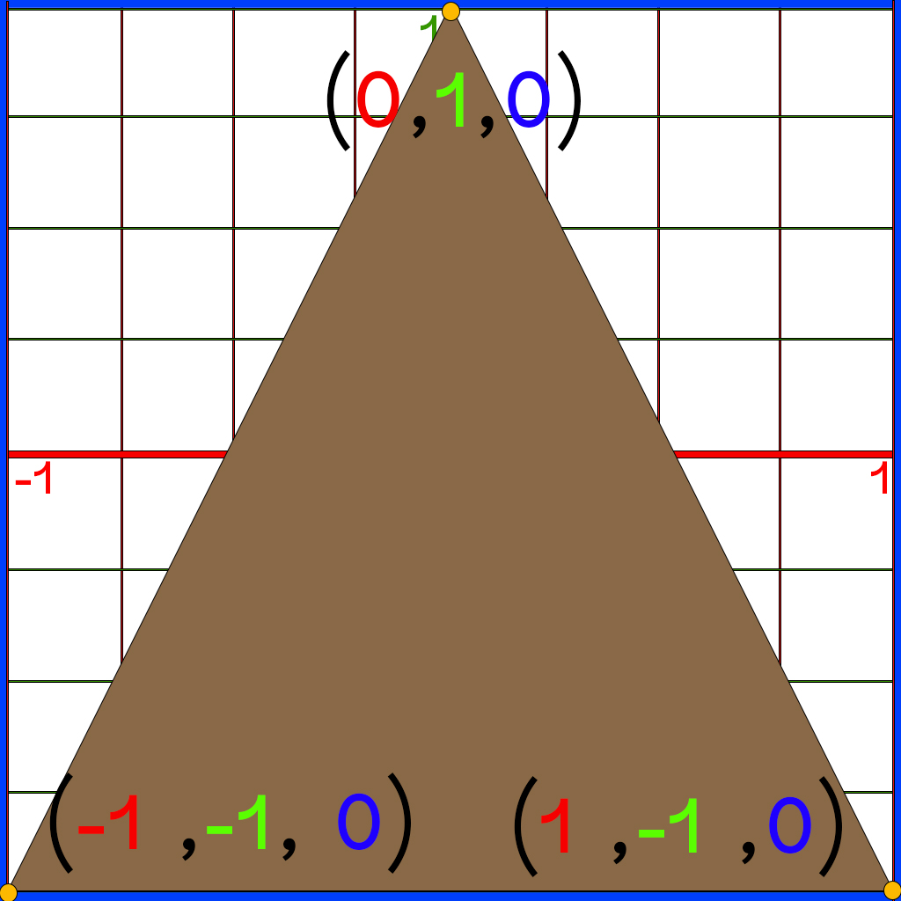

# XVolatile

## Getting Started

`GLEW` : The OpenGL Extension Wrangler Library (GLEW) is a cross-platform open-source C/C++ extension loading library. GLEW provides efficient run-time mechanisms for determining which OpenGL extensions are supported on the target platform.
https://glew.sourceforge.net/

`GLFW` : an Open Source, multi-platform library for OpenGL, OpenGL ES and Vulkan development on the desktop. It provides a simple API for creating windows, contexts and surfaces, receiving input and events.
https://www.glfw.org/

To get started, a new c++ project was created in visual studio.
GLEW and GLFW were downloaded (pre-compiled binaries) and placed in the `ExternalLibs` directory.

These are the subsequent steps to take:

1. Open Solution Properties
2. Add the header files to include. In `C/C++ > General > Additional Include Directories` - added the following:
   - $(SolutionDir)/../ExternalLibs/glew-2.1.0/include
   - $(SolutionDir)/../ExternalLibs/glfw-3.3.8/include
3. Add the source files to include. In `Linker > General > Additional Library Directories` - added the following
   - $(SolutionDir)/../ExternalLibs/glew-2.1.0/lib/Release/x64
   - $(SolutionDir)/../ExternalLibs/glfw-3.3.8/lib-vc2022
4. Add the included libraries to the project dependencies, including the GLFW and GLEW library files, as well as the built in `opengl32` library. In `Linker > Input > Additional Dependencies` - added the following:
   - opengl32.lib;
   - glew32.lib;
   - glfw3.lib;
5. Copy the Dynamic Linking Library file `glew32.dll` from `ExternalLibs\glew-2.1.0\bin\Release\x64` to the root solution directory.

## Initializing the Window

The `XVolatile.cpp` file is the main entry point into the application, housing the `int main()` function, where the GLFW Window is created.
Initialization of the app and the window is a simple process, involving these following steps:

1. Setup GLFW window properties
   - Set OpenGL version to use (`GLFW_CONTEXT_VERSION_MAJOR` and `GLFW_CONTEXT_VERSION_MINOR`)
   - Disable older versions and prevent them from compiling `glfwWindowHint(GLFW_OPENGL_PROFILE, GLFW_OPENGL_CORE_PROFILE)`
   - Allow forward compatibility `glfwWindowHint(GLFW_OPENGL_FORWARD_COMPAT, GL_TRUE);`
2. Create GLFW window
   - Create a `GLFWwindow` pointer using `glfwCreateWindow()`
   - Set Buffer Size information using `glfwGetFramebufferSize()`
   - Set up Context for GLEW to use, using `glfwMakeContextCurrent(mainWindow)`
   - Can also enable support of experimental features, via `glewExperimental = GLFW_TRUE;`
3. Create GLEW Context. Initialize context by verifying that `glewInit() == GLEW_OK`
4. Setup viewport Size, using `glViewport()`
5. Enter the main loop
   - Get and handle user events using `glfwPollEvents()`. This allows for automatically refreshing the window when it's resized, and collecting other event data
   - Clear the previous frame buffer using `glClear()`. This function accepts an argument, to be told specifically which resource to clear
   - Replace the previously drawn scene/frame, with the new and currently updated scene/frame - using `glfwSwapBuffers(mainWindow);`

## Rendering Pipeline Stages

Rendering is a multi-staged process in which a 3d scene (which is comprised of vector data, matrices, polygons and their coordinate data, shading, and more) has it's data sent to the GPU to be processed and rendered to the screen.
This process spans across 9 distinct stages, where 4 of these stages are reserved for Shading:

1. Vertex Specification
2. Vertex Shader (Programmable)
3. Tesselation Shader (Programmable)
4. Geometry Shader (Programmable)
5. Vertex Post-Processing
6. Primitive Assembly
7. Rasterization
8. Fragment(Pixel) Shader (Programmable)
9. Per-Sample Operations

Here is a more in-depth perspective at most of these stages:

##### 1. Vertex Specification:

- The process where vertex data is gathered
- Uses `VAO`, `VBO`, and `Attribute Pointers`
  - `Vertex Array Object` - Defines all the data values needed for each vertex (position, color, texture, normals, etc). Can hold one or multiple VBOs
  - `Vertex Buffer Object` - Defines the data itself
  - `Attribute Pointers` - Defines where and how shaders can access vertex data

##### 2. Vertex Shader:

- The process of applying position data FOR EACH vertex
- Setup of this shader stage is mandatory. Even if you don't need anything from the vertex shader, it still needs to assign vertex data to `gl_Position`, as this data is necessary for later stages
- Inputs to this shader consists of solely the Vertex Data itself
- Outputs from this shader can be used in later shading stages

##### 3. Tessellation Shader:

- Sub-divides topology to allow greater detail, mostly coupled with a height-map
- Can be used to dynamically add levels of detail based on distance from the camera
- A relatively new addition to the OpenGL rendering pipeline (version 4.0)

##### 4. Geometry Shader:

- Handles group of vertices together
- Can be used to create and manipulate primitive shapes

##### 5. Vertex Post-Processing:

- The process of committing to the vertex data and determining which vertices are redundant
- `Transform Feedback` - The result of the Vertex and Geometry stages that were saved to buffers for later use. Mandatory only if the vertex Position data is updated each frame
- `Clipping` - Conversion of units from `clip space` to `window space`. Additionally, any primitive that is not visible in the rendering space is being removed from rendering. as an optimization

##### 6. Primitive Assembly:

- Vertices are converted to a series of primitives
- `Face Culling` - removes any backward-facing polygon from rendering (anti-normals)

##### 7. Rasterization:

- Converts primitives into "Fragments" - `Fragments` are the pieces of data for each pixel - obtained from the rasterization process
- Fragment data is interpolated based on the relative position of each pixel

##### 8. Pixel Shader:

- The Fragment shader stage, is the process where each pixel is assigned an RGB value, according to the Fragment data
- Is optional but it’s rare to not use it. Exceptions are cases where only depth or stencil data is required
- Most important output is the color of the pixel that the fragment covers

##### 9. Per-Sample Operations:

- Series of tests run to see if the fragment should be drawn
- Most important test: Depth test. Determines if something is in front of the point being drawn
- `Color Blending` - can blend fragment color data with overlapping fragment color data (usually for transparency)
- Fragment data written to currently bound FrameBuffer (usually the default buffer)
- At this point usually a `Buffer Swap` is demanded - putting the newly drawn-to updated Frame-Buffer to the front, with that completing the rendering cycle

#### Summary

- Rendering Pipeline consists of several stages

- Four stages are programmable via shaders (Vertex, Tessellation, Geometry, Fragment)

- Vertex Shader is mandatory

- Vertices: User-defined points in space

- Primitives: Groups of vertices that make a simple shape (usually a triangle)

- Fragments: Per-pixel data created from primitives

- Vertex Array Object (VAO): WHAT data a vertex has

- Vertex Buffer Object (VBO): The vertex data itself

- Shader programs are created with at least a Vertex Shader and then activated before use

## OpenGL Coordinate System

OpenGL uses `X` for Left to Right, `Y` for Up and Down, and `Z` for forwards and backwards like depth.

Before we draw something to the GL viewport, we need to consider OpenGL's default view orientation.
By default, the "camera view" of the OpenGL viewport is positioned on the `Z` axis, looking at the side section of the `X` and `Y` axes, as if it was a graph.
The default viewable range spans from (-1,-1) to (1,1), measured in cm.
Essentially, the initial viewport view consists of these 4 points:

- (-1,-1,0)
- (1,-1,0)
- (1,1,0)
- (-1,1,0)

The following image demonstrates the default view seen by the OpenGL viewport (although without the grid visually displayed).
Notice how we cannot see the `Z` axis in this 2D representation - as it initially serves as the axis of projection.
The `Z` axis is represented as the encompassing `blue` box in this image.


If we were to describe a triangle within these default set bounds, we could do so like this:

        -1.0f, -1.0f, 0.0f,            //Vertex No. 01

        1.0f, -1.0f, 0.0f,             //Vertex No. 02

        0.0f, 1.0f, 0.0f               //Vertex No. 03

When drawn to the viewport, the triangle would appear as such:



## Rendering In Practice

In this following example, we will complete a full render cycle, drawing a triangle to the screen.

This setup would consist of all mandatory Rendering Stages discussed earlier.

#### I) Vertex Specification

###### 1. Define the shape to render

In this function, we define a `GLfloat` array that describes a triangle with 3 vertices, made up of 9 members in total.
For now, we make a mental segregation, where each 3 subsequent indices in the array compose a single Vector point (later we splice this array as such).

```cpp
void CreateTriangle()
{
   GLfloat Vertices[] = {
      -1.0f, -1.0f, 0.0f,
      1.0f, -1.0f, 0.0f,
      0.0f, 1.0f, 0.0f
   };
}
```

###### 2. Create a VAO

To render this description of a triangle, we would start by creating a VAO.
A VAO is an OpenGL object that encapsulates the configuration of vertex attribute pointers and their associated vertex buffers.

Creating a `Vertex Array Object` is done by calling the `glGenVertexArrays()` function.
This function allows us to dynamically reserve memory on the graphics card for one or even multiple arrays of Vertices.
Upon creation, the resulting Vertex Array would get a unique ID, which can be used to refer to that array later on.

This function expects 2 parameters:

- an integer, defines the number of arrays that should be created. Memory allocation is then transferred on to the GPU
- An address of a `GLuint` object, in which the ID of the array that was created by the function will be stored

Once created, the array will need to be bound in to the rendering cycle, using the `glBindVertexArray()` function.
function is used to bind a vertex array object (VAO) for subsequent use in rendering operations:

```cpp
GLuint VertexArrayObject;
...
void CreateTriangle()
{
   GLfloat Vertices[] = {
      -1.0f, -1.0f, 0.0f,
      1.0f, -1.0f, 0.0f,
      0.0f, 1.0f, 0.0f
   };

   glGenVertexArrays(1, &VertexArrayObject);
   glBindVertexArray(VertexArrayObject);
}
```

When `glBindVertexArray()` is called with a VAO identifier as the argument, it sets that VAO as the currently active VAO in the OpenGL context. Subsequent OpenGL calls that depend on vertex data will use the state stored in the bound VAO.

To understand the purpose of `glBindVertexArray()`, it's important to understand how vertex data is organized and accessed in OpenGL. Vertex data typically consists of attributes such as position, color, normal, and texture coordinates. These attributes are stored in one or more vertex buffers.

The VAO acts as a container for the configuration of vertex attributes and their associated vertex buffers. It specifies how the attributes are organized and how they are accessed by the vertex shader during rendering. By binding a VAO using `glBindVertexArray()`, you indicate that subsequent rendering operations should use the vertex attribute configuration stored in that VAO.

###### 3. Create a VBO

In OpenGL, a VBO stands for Vertex Buffer Object. It is a buffer object that holds vertex data, such as positions, normals, colors, and texture coordinates, used in rendering 3D geometry.

A VBO provides a way to efficiently store and manage vertex data on the GPU (Graphics Processing Unit). Instead of sending vertex data to the GPU on a per-vertex basis, which can be slow and inefficient, you can upload the vertex data to a VBO once and then use it for multiple rendering operations.

---

Creating our VBO starts somewhat similar to how we created the VAO - we generate an object, and bind it to the current context.
However, we then have to specify how much memory should the buffer reserve for this array, using the `glBufferData()`.

This function expects 4 parameters:

- The context to bind to (`GL_ARRAY_BUFFER`)
- The size that should be reserved in memory for the array (`sizeof(GLfloat) * 9` or `sizeof(Vertices)`)
- The actual array that holds the vertex data (`Vertices`)
- The method by which vertices will be drawn (`GL_STATIC_DRAW`)
  - A static draw means that the vertices location cannot change during runtime. If vertices were to move, like World Position Offset, then `GL_DYNAMIC_DRAW` would have been needed to be used instead, with a slightly different setup

```cpp
glBufferData(GL_ARRAY_BUFFER, sizeof(GLfloat) * 9, Vertices, GL_STATIC_DRAW);
```

---

Once memory for the vertex data has been allocated, we will need to specify the layout and structure of it, using `glVertexAttribPointer()`.
This function is defining how the data of the array should be read and processed.
Using this function, we can explicitly specify for OpenGL to treat each chunk of 3 members as a single structure.
Alternatively, we could have structured and formatted the array to include more types of data, such as color, and then tell this function to skip every 3 members within the array. Similarly, if we wanted to include color AND some other data layer in addition to the position, we could tell this function to skip 6 members.

Here is what such array might look like:

```cpp
      -1.0f, -1.0f, 0.0f,        //POSITION - Vert #01
      1.0f, 0.0f, 0.0f,          //  Color
      1.0f, 0.0f, 0.0f,          //    SomeOtherData
      1.0f, -1.0f, 0.0f,         //POSITION - Vert #02
      0.0f, 1.0f, 0.0f,          //  Color
      1.0f, 0.0f, 0.0f,          //    SomeOtherData
      0.0f, 1.0f, 0.0f           //POSITION - Vert #03
      0.0f, 0.0f, 1.0f,          //  Color
      1.0f, 0.0f, 0.0f,          //    SomeOtherData
```

The `glVertexAttribPointer()` function takes in many different parameters, and it is important to understand what each and every one of them means, and what is it used for:

- `Index`: The address location. This address number needs to also be referenced in the shader later on | (`0`)
- `Size`: Specifies the number of components per vertex attribute. The number of adjacent members in the index to consider a singular structure | (`3`)
- `Type`: This parameter indicates the data type of each component in the attribute | (`GL_FLOAT`)
- `Normalized`: Toggle whether the vertex attribute values should be normalized or not | (`GL_FALSE`)
  - If set to `GL_TRUE`, the attribute values will be normalized to a range of [-1, 1] or [0, 1], depending on the attribute type
- `Stride`: Specifies the byte offset between consecutive attributes. `0` means no stride, and the array is read as is, according to the `Size` groupings | (`0`)
- `Offset`: The amount of offset to apply before reading the array. Can exclude certain vertices this way. `0` means no offset | (`42`)

```cpp
glVertexAttribPointer(0, 3, GL_FLOAT, GL_FALSE, 0, 0);
```

---

Lastly, we will need to call to the `glEnableVertexAttribArray()` function, to actually enable the attributes we are using.
This function takes a single input parameter, which is the location address that was previously fed to the address at `glVertexAttribPointer()`.

These 2 values (`0` in this case) correspond to each other - and this value is also needed by the VertexShader, as we will later see:

```cpp
glVertexAttribPointer(0, ...);
...
glEnableVertexAttribArray(0);
```

---

Creating the VBO can be summarized in these following steps:

1. Generate a VBO identifier using the `glGenBuffers()` function.
2. Bind the VBO using the `glBindBuffer()` function to make it the active VBO.
3. Upload the vertex data to the VBO using the `glBufferData()` or `glBufferSubData()` function.
4. Configure vertex attribute pointers using the `glVertexAttribPointer()` function, specifying the layout and structure of the vertex data.
5. Enable the vertex attributes using the `glEnableVertexAttribArray()` function.
6. Can finally Draw the geometry using drawing commands such as `glDrawArrays()` or `glDrawElements()`.

```cpp
GLuint VertexArrayObject, VertexBufferObject;
...
void CreateTriangle()
{
   GLfloat Vertices[] = {
      -1.0f, -1.0f, 0.0f,
      1.0f, -1.0f, 0.0f,
      0.0f, 1.0f, 0.0f
   };

   glGenVertexArrays(1, &VertexArrayObject);
   glBindVertexArray(VertexArrayObject);

   glGenBuffers(1, &VertexBufferObject);
   glBindBuffer(GL_ARRAY_BUFFER, VertexBufferObject);
   glBufferData(GL_ARRAY_BUFFER, sizeof(GLfloat) * 9, Vertices, GL_STATIC_DRAW);
   glVertexAttribPointer(0, 3, GL_FLOAT, GL_FALSE, 0, 0);
   glEnableVertexAttribArray(0);
}
```

###### 4. UnBind the VBO and VAO

Once all vertex specification data was passed to the GPU, we will need to unbind the `Buffer` and the `VertexArray`.

This happens very much like a babushka setup:

```html
<VertexArrayObject>
  <VertexBufferObject>
    <!-- upload, specify and enable vertex data & attributes -->
  </VertexBufferObject>
</VertexArrayObject>
```

By calling the `Bind` functions and passing `0` to them, we effectively unbind the vertex data from the memory allocation:

```cpp
GLuint VertexArrayObject, VertexBufferObject;
...
void CreateTriangle()
{
   GLfloat Vertices[] = {
      -1.0f, -1.0f, 0.0f,
      1.0f, -1.0f, 0.0f,
      0.0f, 1.0f, 0.0f
   };

   // Create VAO and Bind
   glGenVertexArrays(1, &VertexArrayObject);
   glBindVertexArray(VertexArrayObject);

   // Create VBO and Bind
   glGenBuffers(1, &VertexBufferObject);
   glBindBuffer(GL_ARRAY_BUFFER, VertexBufferObject);

   // Allocate storage space on GPU, upload the vertex data according to some specification, and enable the vertex data array
   glBufferData(GL_ARRAY_BUFFER, sizeof(Vertices), Vertices, GL_STATIC_DRAW);
   glVertexAttribPointer(0, 3, GL_FLOAT, GL_FALSE, 0, 0);
   glEnableVertexAttribArray(0);

   // Unbind VBO and VAO
   glBindBuffer(GL_ARRAY_BUFFER, 0);
   glBindVertexArray(0);
}
```

#### II) Vertex Shader
